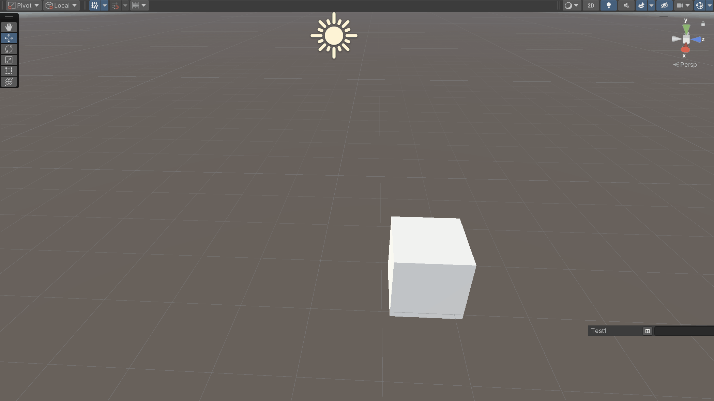

# SceneSaveTool
 
씬을 현재 사항을 저장하고 불러올 수 있는 SceneSaveTool입니다.

## Use

SceneView 하단 부분에 UI에 이름을 입력하고 옆 저장 버튼을 눌러줍니다.   
현재 씬에 적용된 사항이 따로 **Asset/SceneSaveFile/현재씬 이름/입력한Text**에 저장됩니다.

Load를 클릭하여 저장한 사항을 불러옵니다.   
Delete를 클릭하여 저장 사항을 삭제할 수 있습니다.
